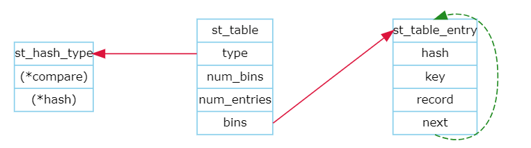

## Preface
  
MarkPress is a command line tool to create and publish markdown post for WordPress.

## Features

- Syntax highlighting for fenced code block.
- Meta header in markdown to describe title / categories / tags.
- Supports GraphViz scripts to render graphics.
- Supports Proxy (HTTP/SOCKS4/SOCKS5).

## Installation

Clone the repository to some where you like:

```bash
git clone https://github.com/skywind3000/markpress.git ~/.local/app/markpress
```

Add `bin` folder in your `$PATH`, put the line below in your `.bashrc` / `.zshrc`:

```bash
export PATH="~/.local/app/markpress/bin:$PATH"
```

If you don't want to modify `$PATH`, you can create a symbol link for `markpress/bin/markpress` and put it in somewhere within your `$PATH`.

Install requirements:

```bash
sudo pip install python-wordpress-xmlrpc markdown beautifulsoup4 PySocks
```

Now, command `markpress` is ready to work.


## Quick Start

First, create `config.ini` in `~/.config/markpress`:

```ini
[default]
tabsize=4

[0]
url=http://your-wordpress.com/
user=USERNAME
passwd=PASSWORD
```

Multiple sites can be defined in different section, like `[0]`, `[1]` and `[2]`. Section `0` is the default site.

After that, we can create a new document:

```bash
markpress -n mypost.md
```

MarkPress will create a new markdown document with meta header:

```
---
uuid: 1234
title:
status: draft
categories:
tags:
---
```

WordPress server will allocate a unique `uuid` for each new post, and use it for post identification. Now you can edit `mypost.md` with your favorite edit and write something like:

```
---
uuid: 1234
title: How to use asyncio in python ?
status: publish
categories: Development
tags: python, server
---
# Why you need asyncio ?

- reason 1
- reason 2
- reason 3

# Principle behind the asyncio

...
```

Don't forget to change `status` from `draft` to `publish`. At last use MarkPress to update your document to server:

```bash
markpress -u mypost.md
```

You may see the output:

```
post uuid=1234 updated: mypost.md
https://www.xxxx.com/blog/?p=1234
```

Now you can use the output url above to access your document.

For Windows, use `-o` to open the url in your favorite browser:

```bash
markpress -o mypost.md
```

That's all you need to know.

## Options

### Syntax Highlighting

When you are using fenced code block like:

`````
```cpp
int x = 10;
int y = 20;
```
`````

MarkPress will translate it to:

```html
<pre><code class="cpp">int x = 10;
int y = 20;
</code></pre>
```

A wordpress plugin "WP Code Highlight.js" can color each `<code>` tags by using [highlight.js](https://highlightjs.org/):

```cpp
int x = 10;
int y = 20;
```

It supports 185 languages with 89 styles and will definitely satisfy your need.


You can change the code block styles and modify css in the setting page of "WP Code Highlight.js" in your wordpress dashboard.


### MathJax

[MathJax](https://www.mathjax.org) is a JavaScript display engine for mathematics. The most easy way to use it in WordPress is using the "Simple MathJax" plugin.

By default:

- Expression within `$...$` will be rendered inline.
- Expression within `$$...$$` will be rendered in block. 

```
$\sum_{n=1}^{100} n$
```

Will be rendered as:


and:

```
$$
AveP = \int_0^1 p(r) dr
$$
```

Will be rendered as:


Backslash can be used for escaping the `$`, if you have to input a \$ (dollar) sign in your document, escape it like `\$`.

## GraphViz

MarkPress supports [GraphViz](https://www.graphviz.org/) to render diagrams:

`````
```viz-dot
graph g {
    A -> B
    B -> C
    B -> D
}
```
`````

Code block with `viz-{engine}` notation will be compiled into inline SVG xml in your post. and be rendered by browser like:


Engine `dot`, `circo`, `neato`, `osage`, or `twopi` are supported.

`GraphViz` must be installed to enable this. MarkPress needs to find the GraphViz executables (like `dot`, `circo` ...). If they are inaccessible from environment variable `$PATH`, you can tell MarkPress how to find them  in `config.ini`:

```ini
[default]
tabsize=4
graphviz=d:/dev/tools/graphviz/bin
```

We can use another engine `circo` in a `viz-circo` block:

`````
```viz-circo
digraph st2 {
 rankdir=TB;
  
 node [fontname = "Verdana", fontsize = 10, color="skyblue", shape="record"];
 edge [fontname = "Verdana", fontsize = 10, color="crimson", style="solid"];
  
 st_hash_type [label="{<head>st_hash_type|(*compare)|(*hash)}"];
 st_table_entry [label="{<head>st_table_entry|hash|key|record|<next>next}"];
 st_table [label="{st_table|<type>type|num_bins|num_entries|<bins>bins}"];
  
 st_table:bins -> st_table_entry:head;
 st_table:type -> st_hash_type:head;
 st_table_entry:next -> st_table_entry:head [style="dashed", color="forestgreen"];
}
```
`````

Result:



A lot of funny examples are available in [GraphViz Gallery](https://www.graphviz.org/gallery/).

### Python-markdown

MarkPress ships with a light-weight markdown parser called [markdown2](https://github.com/trentm/python-markdown2). Most of time it works just fine. 

But you can still change it to a much powerful one: [python-markdown](https://github.com/Python-Markdown/markdown). To setup this, add `engine=markdown` option in the `default` section of your `config.ini`:

```ini
[default]
engine=markdown
...
```

The `engine` can be one of:

- `native`: default builtin markdown2 parser.
- `markdown`: python-markdown parser.
- `pandoc`: as its name.

The `python-markdown` has a lot of [official](https://python-markdown.github.io/extensions/) and [third-party](https://github.com/Python-Markdown/markdown/wiki/Third-Party-Extensions) extensions.

Declare the extensions as a comma separated list in the `config.ini`:

```ini
[default]
engine=markdown
extensions=pymdownx.emoji,pymdownx.details,pymdownx.magiclink,pymdownx.tilde
...
```

Remember to install them before that:

```bash
pip install pymdown-extensions
```

Then we can use github emoji markup like `:sunglasses:` in our markdown document, and it will be rendered as: :sunglasses:

And use `~~tilde~~` to represents ~~tilde~~.

There can also be a `~/.config/markpress/extensions.py` file can be used to define a `extension_configs` dict object which will be passed to `python-markdown`.

### Proxy

Proxy is specified in the site sections:

```ini
[0]
url=https://www.xxxx.com/
user=jim
passwd=xxxxx
proxy=socks5://localhost:1080
```

PySocks Supports three protocols: `http`, `socks4` and `socks5`.


## Visual Studio Code

A VSCode plugin: [Markdown Preview Enhanced](https://github.com/shd101wyy/markdown-preview-enhanced) is recommended to work with MarkPress.

It supports MathJax and GraphViz preview directly. The only thing we need to take care is MPE uses a different notion for GraphViz:

`````
```viz {engine="dot"}
script
```
`````

We can config MPE to support our `viz-{engine}` notion, use `CTRL+SHIFT+P` and input:

    Markdown Preview Enhanced: Extend Parser

Press `ENTER` and write a parser extender like:

```javascript
module.exports = {
  onWillParseMarkdown: function(markdown) {
    return new Promise((resolve, reject)=> {
      var reg = new RegExp("^\\s*\\`\\`\\`viz-(\\S+)\\s*$", "g");
      var parts = markdown.split("\n");
      var output = new Array();
      for (var j = 0; j < parts.length; j++) {
        var text = parts[j];
        var n = text.match(reg);
        if (n != null) {
          var pos = text.indexOf("```viz-");
          if (pos >= 0) {
            var name = text.substr(pos + 7).trim();
            text = text.substr(0, pos) + "```viz {engine=\"" + name + "\"}";
          }
        }
        output.push(text);
      }
      markdown = output.join("\n");
      return resolve(markdown)
    })
  },
  onDidParseMarkdown: function(html) {
    return new Promise((resolve, reject)=> {
      return resolve(html)
    })
  }
}
```

It will translate `viz-xxx` to `viz {engine="xxx"}` before parsing. Then press `CTRL+S` to save the javascript.

Now MPE is capable to recognize our `viz-xxx` code blocks.

